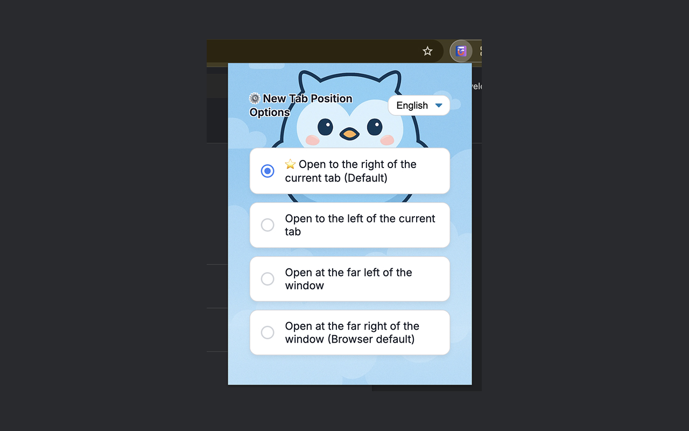

# TabMagnet - Open Tabs Next to Current

Chrome extension for configuring new tab positions in browser windows with multilingual support.
https://chromewebstore.google.com/detail/tabmagnet/hcjodleodhbpnjcdfgdahdfnadfmfikn

## Key Features
- **Customizable new tab positions**:
  - Right side of current tab (default)
  - Left side of current tab
  - Far left in window
  - Far right in window (browser default)
- **Smart tab close behavior**:
  - Switch to left tab when closing (default)
  - Switch to right tab when closing (browser default)
  - Smart switching (parent → left → right)
- **Tab Group Preservation**: Maintains Chrome tab groups when moving tabs
- Multilingual interface (English/Chinese/Japanese)
- Automatic preference saving
- Responsive options page

## Project Structure
TabMagnet/
├── _locales/
│   ├── en/                 # English locale
│   ├── zh_CN/              # Simplified Chinese
│   └── ja/                 # Japanese locale
├── images/                 # Extension icons
├── background.js           # Background logic
├── manifest.json           # Extension manifest  
├── options.html            # Options page
├── options.css             # Options page styles
└── options.js              # Options page logic

## Installation
```bash
# Load unpacked extension
1. Open Chrome extensions page: chrome://extensions/
2. Enable "Developer mode"
3. Click "Load unpacked"
4. Select this repository directory

## Localization Support
Available languages:

- English (en)
- Simplified Chinese (zh_CN)
- Japanese (ja)

How to switch languages:
1. Click extension icon in toolbar
2. Select language from dropdown
3. Interface updates immediately

## Technical Details
- Chrome Manifest V3 compliant
- Uses `chrome.tabs.onCreated` for tab creation events
- Uses `chrome.tabs.onRemoved` for tab close behavior
- Conservative tab movement that respects existing groups
- Syncs settings via `chrome.storage.sync`
- Responsive layout (min-width: 300px)
- Smart filtering to avoid interfering with browser operations

## Recent Updates

### Version 1.1.0 (Latest)
- **✨ New**: Tab close behavior options
  - Switch to left tab when closing (default, recommended)
  - Switch to right tab when closing (browser default)
  - Smart switching (parent tab → left tab → right tab)
- **✨ New**: Improved options page with organized sections
- **⚡ Improved**: Better user experience following best practices

### Version 1.0.6
- **🔧 Fixed**: Tab groups no longer break after browser restart
- **🔧 Fixed**: Prevents all tabs from being grouped together
- **🔧 Fixed**: "Far right" position now works consistently
- **✨ New**: Smart tab filtering to avoid interfering with browser operations
- **✨ New**: Conservative approach that preserves existing groups
- **⚡ Improved**: Better timing and error handling

### Version 1.0.5
- Initial tab group preservation attempt (had issues)

### Version 1.0.4
- Multilingual support improvements
- UI enhancements

## Contributing
Welcome contributions via Issues:
- New translations (update `_locales/` directory)
- Feature requests
- Bug reports

## License
MIT License

```plaintext

Key Implementation Notes:
1. Localization based on `_locales/` directory structure
2. Core logic in `background.js`
3. Options page uses `flex` layout (see `options.css`)

Recommended to include extension screenshot at `images/screenshot.png`.
